

   

  

# DIPALZA Mobile

## Manual de Usuario

### Sistema de Ventas en Ruta

  

---

**Versión:** 1.0.0 · **Build:** 11

**Fecha:** Abril 2026

---

   

## Contenidos

1. [Configuración de Parámetros Técnicos y Conectividad](#1-configuración-de-parámetros-técnicos-y-conectividad)
   - 1.1. Configuración del Servidor Central
   - 1.2. Definición de Preferencias Operativas
   - 1.3. Retorno a la Ventana de Ingreso
2. [Protocolo de Autenticación y Apertura de Sesión](#2-protocolo-de-autenticación-y-apertura-de-sesión)
3. [Gestión de Operaciones en el Módulo de Ventas](#3-gestión-de-operaciones-en-el-módulo-de-ventas)
4. [Monitorización del Estado del Sistema](#4-monitorización-del-estado-del-sistema)
5. [Acceso a Configuración desde el Menú Lateral](#5-acceso-a-configuración-desde-el-menú-lateral)
6. [Control de Versiones](#6-control-de-versiones)

## 1. Configuración de Parámetros Técnicos y Conectividad
Antes de iniciar cualquier operación, es imperativo establecer la infraestructura de comunicación entre el dispositivo móvil y el sistema central.

### 1.1. Configuración del Servidor Central
El acceso al servidor garantiza la actualización en tiempo real de inventarios y precios.
1.  **Ingreso al Panel:** Pulse en la opción **Configurar** desde la pantalla de bienvenida.
2.  **Identificación de IP/URL:** Seleccione "Dirección del servidor". Se desplegará un campo de edición donde deberá ingresar el protocolo de transferencia (ej: `http://ventas.dyanlias.net:8080`).
3.  **Validación de Enlace:** Es mandatorio presionar el botón **Probar conexión**.
    * **Estado Exitoso:** Aparecerá un círculo verde con un check interno.
    * **Estado de Fallo:** Un aviso rojo indicará "No se puede conectar con el servidor". En este caso, verifique la cobertura de red o la validez de la URL.
4.  **Confirmación:** Presione **Guardar** para fijar el punto de enlace.

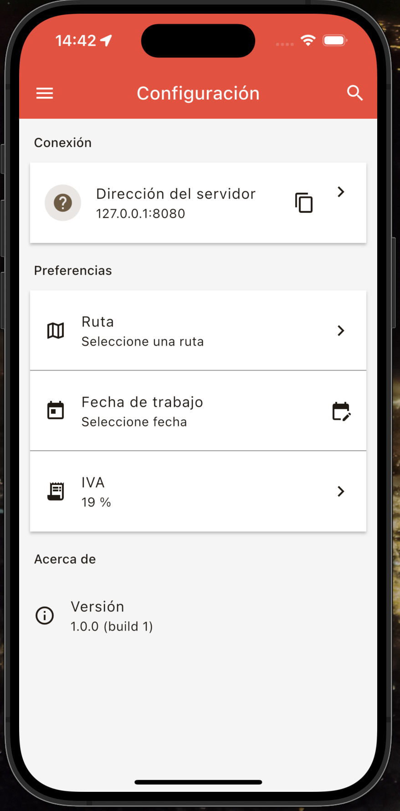
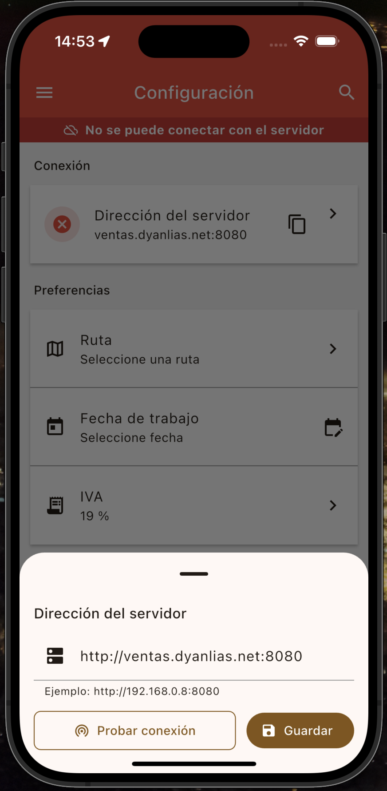
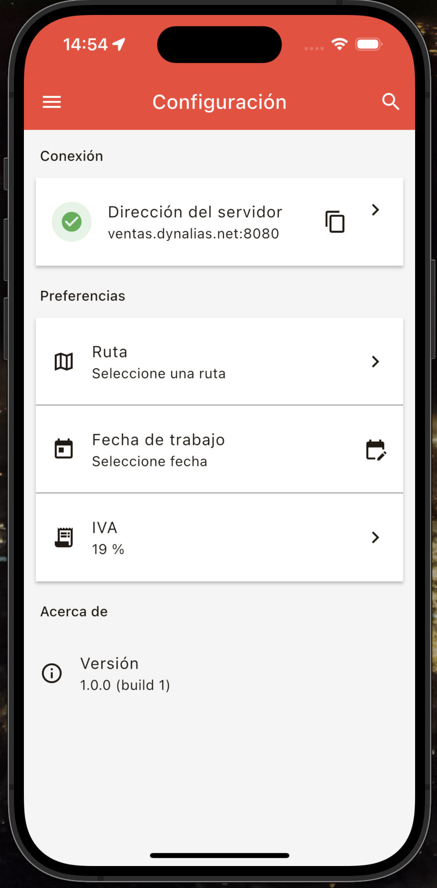

### 1.2. Definición de Preferencias Operativas
En el mismo menú de Configuración, se deben preestablecer los valores fiscales y logísticos:
* **IVA:** El sistema viene configurado por defecto al **19%**. Cualquier modificación debe ser autorizada por el administrador.
* **Fecha de trabajo:** Define el periodo contable en el que se registrarán las facturas.
* **Ruta:** Permite fijar una zona predeterminada para agilizar el ingreso diario.

### 1.3. Retorno a la Ventana de Ingreso
Para volver a la ventana de ingreso es posible deslizando desde el borde izquierdo de la pantalla hacia la derecha, lo que revela la ventana de Ingreso.

## 2. Protocolo de Autenticación y Apertura de Sesión
El sistema emplea un método de validación de cuatro niveles para asegurar que la facturación se asigne correctamente al vendedor y a la ruta logística adecuada.

### 2.1. Credenciales de Identidad
* **Vendedor:** Ingrese su código de usuario. El campo requiere un **mínimo de 3 caracteres**.
* **Contraseña:** Ingrese su clave de seguridad. Por estándares de protección, debe poseer **más de 6 caracteres**. El sistema permite visualizar el texto pulsando el icono del ojo para evitar errores de tipeo.

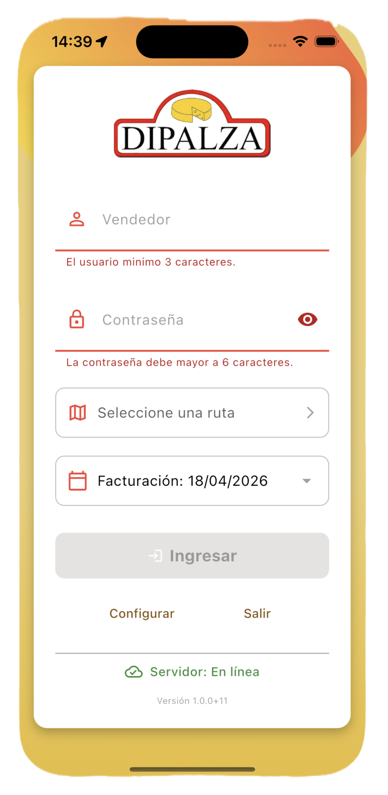

### 2.2. Parámetros de la Jornada
Para habilitar el botón **Ingresar**, se deben completar dos selecciones críticas:
1.  **Selección de Ruta:** Pulse el campo correspondiente para desplegar el catálogo de rutas (ej: *LA LIGUA 1, PAPUDO, CONCON, QUILLOTA JOSE*). Cada ruta está vinculada a un código interno (001, 002, etc.) que determina la carga de clientes.
2.  **Fecha de Facturación:** Al pulsar sobre la fecha, se activará un calendario interactivo. Asegúrese de que la fecha seleccionada coincida con la jornada de despacho real para evitar discrepancias contables.

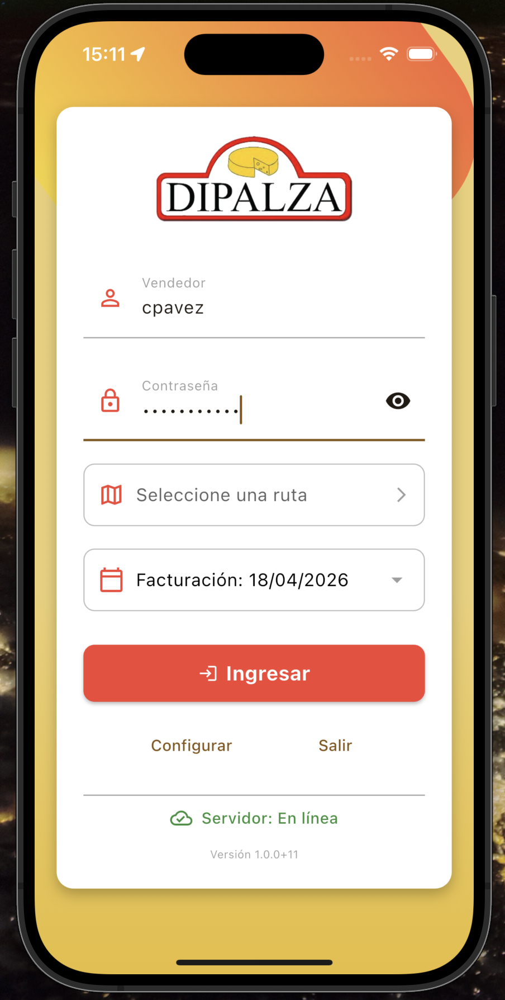
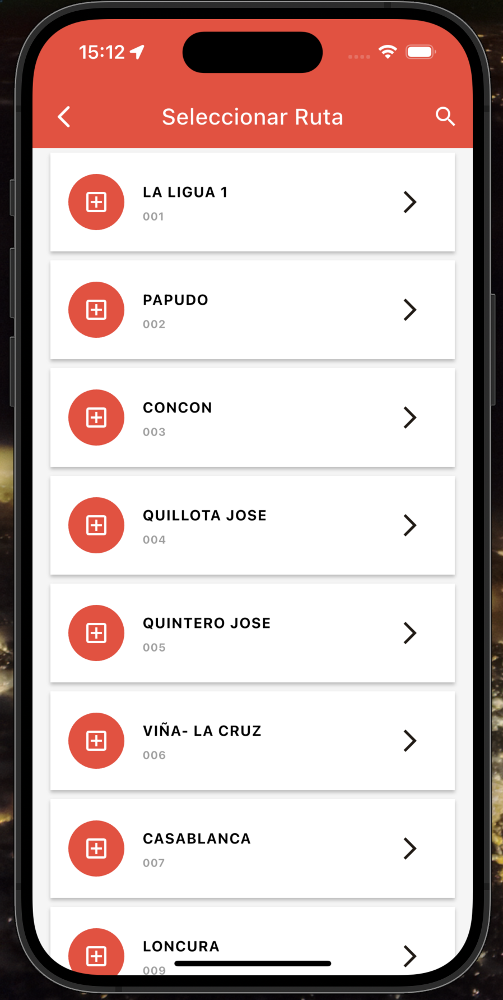
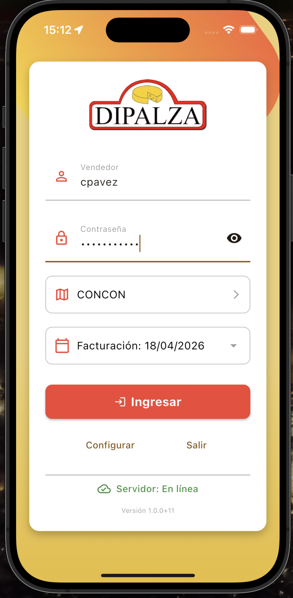
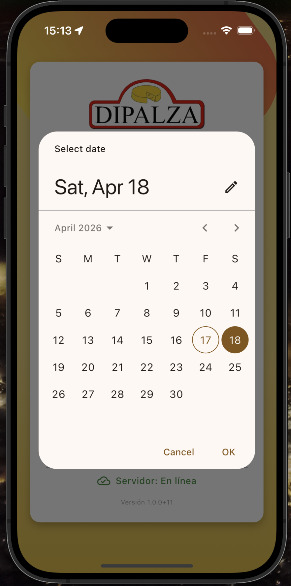

## 3. Gestión de Operaciones en el Módulo de Ventas
Una vez dentro del panel principal, el vendedor dispone de una interfaz simplificada diseñada para el uso en movilidad.

### 3.1. Panel de Ventas del Día
La pantalla central actúa como un resumen ejecutivo de la actividad diaria.
* **Historial Vacío:** Si la pantalla muestra "No hay ventas!!", significa que no se han procesado documentos en la ruta y fecha seleccionadas.
* **Botón de Acción Flotante (FAB):** El botón circular rojo con el símbolo **(+)** es el disparador para iniciar una nueva transacción comercial.

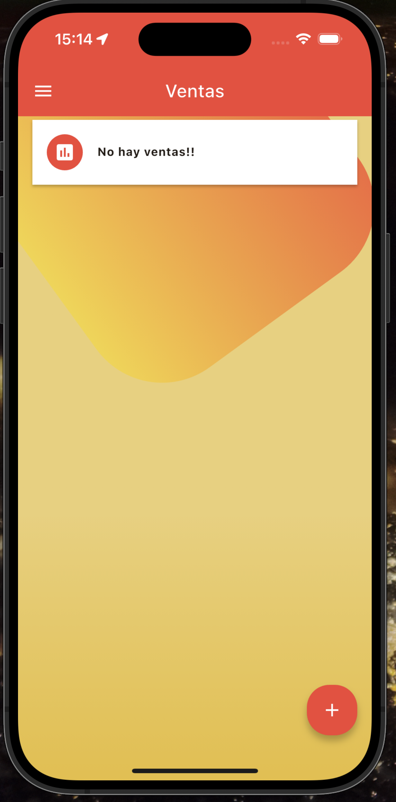

### 3.2. Creación de una Nueva Venta
Al pulsar el botón **(+)** se inicia el flujo de facturación:

1.  **Selección de Cliente:** En la pantalla **Nueva Venta**, pulse el campo "Seleccionar Cliente" para buscar por nombre o código RUT. Seleccione también el método de pago (por defecto: **CONTADO**).

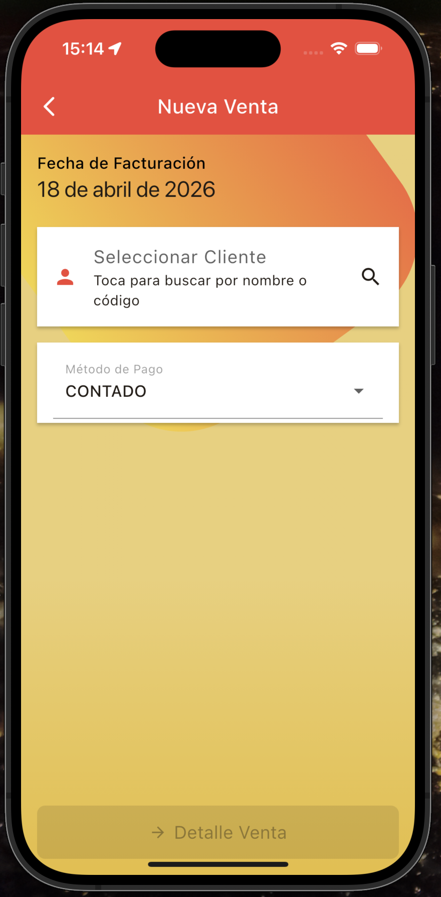
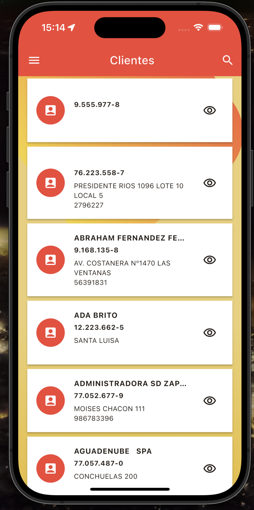

2.  **Detalle de la Venta:** Una vez seleccionado el cliente, se accede al detalle de la venta. Pulse el botón **(+)** para agregar productos.

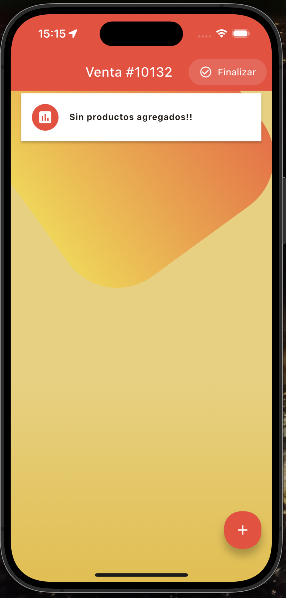

3.  **Agregar Producto:** En la pantalla **Agregar producto**, busque por código o nombre. Luego ingrese la cantidad y el descuento aplicable. El sistema calculará automáticamente el total del ítem.

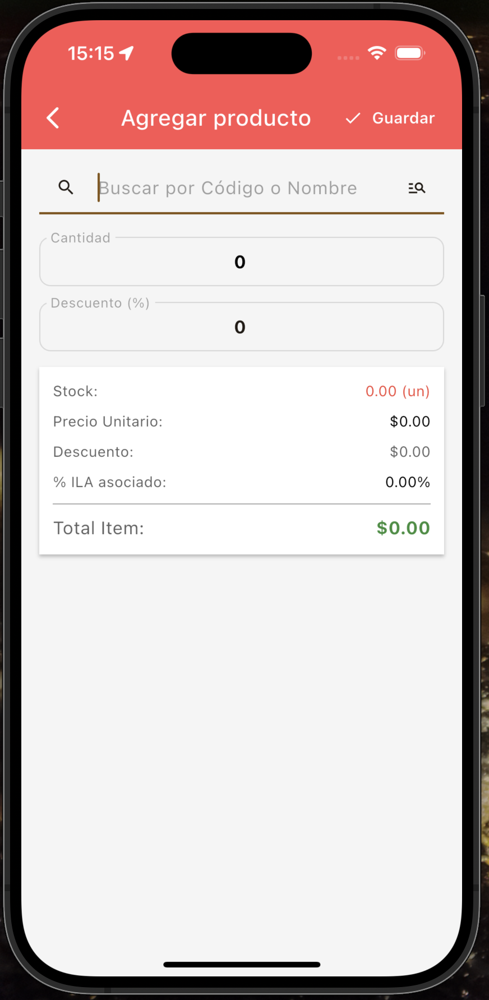
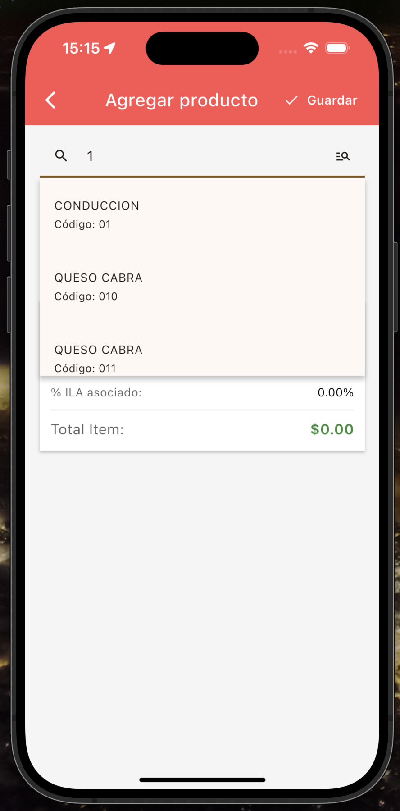

4.  **Producto Agregado:** El producto aparecerá en el detalle de la venta con su precio unitario y total. Repita el proceso para agregar más ítems. Al finalizar, pulse **Finalizar** para registrar la venta.

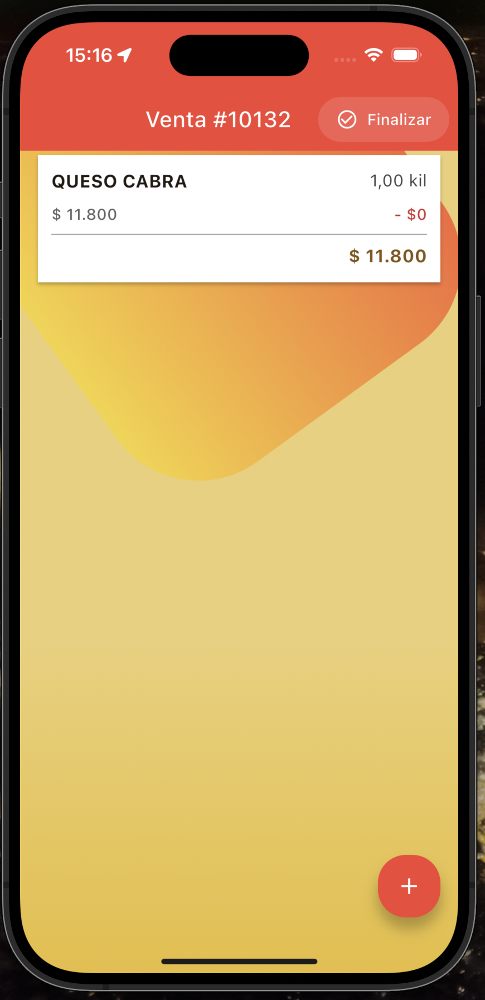

## 4. Monitorización del Estado del Sistema
En la base de la pantalla de login, existe un indicador dinámico de salud del sistema:
* **Servidor: En línea (Icono Verde):** Garantiza que cada venta realizada será transmitida inmediatamente al servidor central.
* **Servidor: Fuera de línea (Icono Rojo):** El sistema almacenará los datos de forma local, pero no habrá sincronización hasta que se restablezca la conexión. Se recomienda no realizar cierres de jornada en este estado.

## 5. Acceso a Configuración desde el Menú Lateral
Desde cualquier pantalla de la aplicación, es posible volver al panel de Configuración o a la pantalla de acceso a través del **Menú Lateral (Drawer)**. Para abrirlo, deslice desde el borde izquierdo o pulse el icono de las tres barras. Las opciones disponibles son:
* **Ventas** — Regresa al panel de ventas del día.
* **Clientes** — Lista de clientes de la ruta.
* **Configuración** — Accede al panel de parámetros técnicos y preferencias operativas.
* **Salir** — Cierra la sesión y regresa a la pantalla de acceso.

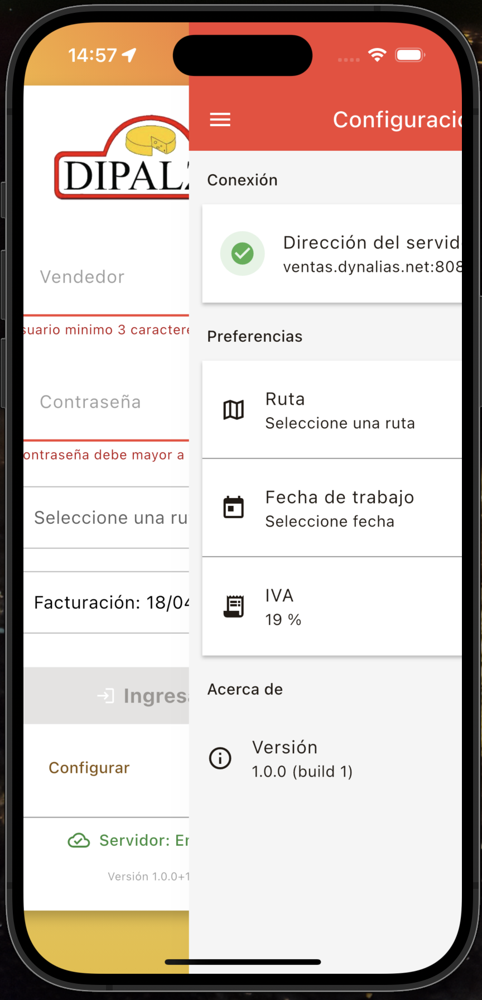

## 6. Control de Versiones
El soporte técnico solo será brindado si la aplicación se encuentra actualizada.
* **Versión Actual:** 1.0.0
* **Build:** 11
* **Referencia:** DIPALZA Mobile - Soporte Técnico.
